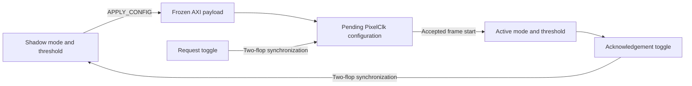
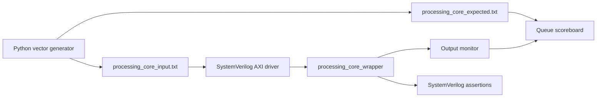
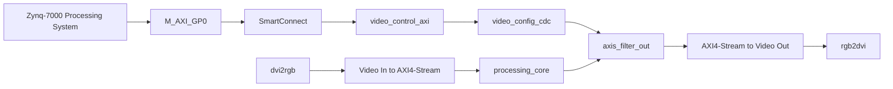

# FPGA 1080p60 AXI4-Stream Video Processor

SystemVerilog RTL, Python reference models, layered verification, and bare-metal runtime control for a real-time FPGA video-processing pipeline.

The project receives HDMI video, converts active pixels into AXI4-Stream transactions, performs grayscale conversion and Sobel edge detection in the Programmable Logic, and transmits the selected result through HDMI output. The current real-silicon target is the **PYNQ-Z2 / Zynq-7020**, operating at **1920 × 1080 at 60 Hz** with an approximately **148.5 MHz pixel clock**.

Runtime mode and threshold configuration is performed by a bare-metal application running on the ARM Cortex-A9. The Processing System accesses a custom AXI4-Lite peripheral through `M_AXI_GP0`, while a bundled-data clock-domain-crossing circuit transfers the configuration into the video clock domain.

## Contents

- #fpga-1080p60-axi4-stream-video-processor
  - #contents
  - #project-status
  - #system-architecture
    - #processing-system-and-programmable-logic
    - #pl-video-processing-path
  - #pynq-z2-hardware-model
  - #video-and-stream-model
  - #supported-output-modes
  - #data-representation
  - [RTL datapath](#rtl-datapscale-conversion
    - #3x3-window-generation
    - #sobel-processing
  - #runtime-configuration
    - #uart-commands
  - #axi4-lite-register-map
  - [Clock-domain crossing](#clock-domaindel-and-verification
    - #expected-transaction
    - #scoreboard-behavior
    - #assertions
    - #verification-modes
  - #vivado-and-pynq-z2-build
    - #current-block-design
    - #build-flow
  - #measured-implementation-results
    - #utilisation
  - [Latency and-throughput-design-decisions
    - #datapath-behavior
    - #spatial-latency
    - #throughput
    - #backpressure-decision
  - #known-limitations
  - #further-documentation
  - #project-structure

## System architecture

### Processing System and Programmable Logic

```mermaid
flowchart LR
    subgraph HOST["Host computer"]
        TERM["PuTTY serial terminal"]
    end

    subgraph PS["Zynq-7000 Processing System"]
        UART["PS UART through MIO"]
        APP["Bare-metal C application"]
        DDR["PS DDR"]
        GP0["M_AXI_GP0"]
        
        UART <--> APP
        DDR <--> APP
        APP --> GP0
    end

    subgraph PL_CTRL["Programmable Logic: 50 MHz AXI control domain"]
        SC["SmartConnect"]
        CTRL["video_control_axi"]
        CDC_AXI["AXI side of video_config_cdc"]
        
        SC --> CTRL
        CTRL -->|"Frozen mode and threshold payload"| CDC_AXI
    end

    subgraph PL_VIDEO["Programmable Logic: approximately 148.5 MHz video domain"]
        CDC_PIXEL["PixelClk side of video_config_cdc"]
        FILTER["axis_filter_out"]
        
        CDC_PIXEL -->|"Active mode and threshold"| FILTER
    end

    TERM <--> UART
    GP0 --> SC
    CDC_AXI --> CDC_PIXEL
```



The Processing System is responsible for:

- Receiving UART commands
- Executing the bare-metal application
- Performing memory-mapped register accesses
- Polling configuration status
- Reporting active configuration values

The Programmable Logic is responsible for:

- Receiving and transmitting HDMI video
- Processing active video pixels
- Maintaining the AXI4-Stream pipeline
- Exposing the custom AXI4-Lite control peripheral
- Crossing configuration into the PixelClk domain
- Applying active mode and threshold values

### PL video-processing path

```mermaid
flowchart LR
    RX["dvi2rgb<br/>HDMI receiver"]
    VIN["Video In to<br/>AXI4-Stream"]
    GRAY["axis_grayscale"]
    WIN["axis_window_3x3_generator"]
    SOBEL["axis_sobel"]
    SEL["axis_filter_out"]
    VOUT["AXI4-Stream to<br/>Video Out"]
    TX["rgb2dvi<br/>HDMI transmitter"]

    RX -->|"Native RGB video"| VIN
    VIN -->|"24-bit AXI4-Stream pixels"| GRAY
    GRAY -->|"8-bit grayscale + aligned RGB"| WIN
    WIN -->|"72-bit 3x3 window + aligned RGB"| SOBEL
    SOBEL -->|"Sobel + grayscale + original"| SEL
    SEL -->|"Selected AXI4-Stream video"| VOUT
    VOUT -->|"Native parallel video"| TX
```



The custom stages are separated so that grayscale conversion, window generation, Sobel arithmetic, output selection, and runtime control can be understood and verified independently before full-system integration.

## PYNQ-Z2 hardware model

The PYNQ-Z2 uses a Zynq-7020 device containing an ARM Processing System and FPGA Programmable Logic.

The live pixel path remains in the PL:

```text
HDMI input
→ PL video receiver
→ PL processing pipeline
→ PL video transmitter
→ HDMI output
```

The PS does not process individual video pixels. It provides low-rate control values through memory-mapped AXI4-Lite transactions:

```text
PuTTY
→ PS UART
→ bare-metal application
→ Xil_Out32 / Xil_In32
→ M_AXI_GP0
→ SmartConnect
→ custom PL control peripheral
```

This separation allows the PL pipeline to sustain one pixel per enabled clock while the PS changes mode and threshold at human-interaction speed.

## Video and stream model

The video bridges convert between native parallel video and AXI4-Stream video.

The custom processing path uses:

```text
TDATA
→ pixel or processing payload

TVALID
→ source is presenting a valid transaction

TREADY
→ receiver can accept the transaction

TUSER
→ first active pixel of a frame

TLAST
→ final active pixel of a line
```

A transfer occurs only when:

```text
TVALID && TREADY
```

If `TVALID` is high while `TREADY` is low, the complete transaction must remain stable.

The custom modules use a globally stalled pipeline:

```verilog
pipeline_enable =
    !m_axis_tvalid || m_axis_tready;
```

When a valid output is blocked, the module freezes:

- Pipeline data
- Valid bits
- `TUSER`
- `TLAST`
- Raster counters
- Window history
- Line-buffer writes
- Grayscale and original-pixel side paths

This preserves transaction and spatial alignment under backpressure.

## Supported output modes

<table>
<tr>
<th>Mode</th>
<th>Value</th>
<th>Output</th>
</tr>
<tr>
<td>Sobel magnitude</td>
<td><code>0</code></td>
<td>Saturated <code>|Gx| + |Gy|</code> magnitude</td>
</tr>
<tr>
<td>Thresholded Sobel</td>
<td><code>1</code></td>
<td>Binary black-and-white edge image</td>
</tr>
<tr>
<td>Grayscale</td>
<td><code>2</code></td>
<td>Fixed-point grayscale value aligned to the Sobel center</td>
</tr>
<tr>
<td>Original</td>
<td><code>3</code></td>
<td>Original RGB pixel aligned to the Sobel center</td>
</tr>
</table>

The threshold is eight bits and can be adjusted from `0` to `255`.

## Data representation

- Input and output pixels are 24 bits wide.
- The current project byte order is `RBG`, retained for compatibility with the existing video path.
- `[23:16]` contains red.
- `[15:8]` contains blue.
- `[7:0]` contains green.
- Internal grayscale samples are eight bits wide.
- The 3x3 grayscale window contains nine eight-bit values and is therefore 72 bits wide.
- Sobel magnitude is saturated to eight bits and replicated across all three output bytes.
- Mode is represented by two bits.
- Threshold is represented by eight bits.
- `TUSER` marks the first transaction of the frame.
- `TLAST` marks the final transaction of each active video line.

The term `original` refers to the original RGB pixel spatially aligned with the Sobel window center. It is not an undelayed bypass of the HDMI input.

## RTL datapath

Detailed behavior should be documented in docs/rtl_datapath.md.

<table>
<tr>
<th>Stage</th>
<th>Responsibility</th>
</tr>
<tr>
<td><code>axis_grayscale</code></td>
<td>Convert the 24-bit input pixel to eight-bit fixed-point grayscale while retaining the original pixel side path</td>
</tr>
<tr>
<td><code>axis_window_3x3_generator</code></td>
<td>Maintain two grayscale line delays, horizontal pixel history, and one original-pixel line delay to generate a 3x3 window and aligned center pixel</td>
</tr>
<tr>
<td><code>axis_sobel</code></td>
<td>Calculate pipelined horizontal and vertical Sobel gradients, absolute values, magnitude, and saturation</td>
</tr>
<tr>
<td><code>axis_filter_out</code></td>
<td>Select Sobel magnitude, thresholded Sobel, grayscale, or aligned original RGB according to the active configuration</td>
</tr>
<tr>
<td><code>video_control_axi</code></td>
<td>Implement the AXI4-Lite control/status register interface, store shadow values, freeze configuration payload, and initiate configuration requests</td>
</tr>
<tr>
<td><code>video_config_cdc</code></td>
<td>Transfer the frozen mode and threshold from the 50 MHz AXI domain into the PixelClk domain and activate the values at a frame boundary</td>
</tr>
</table>

### Grayscale conversion

The grayscale stage uses fixed-point integer arithmetic:

```text
Gray = (77 × Red + 150 × Green + 29 × Blue) >> 8
```

The coefficients approximate:

```text
0.299 × Red
+
0.587 × Green
+
0.114 × Blue
```

The implementation avoids floating-point arithmetic and is pipelined for streaming operation.

### 3x3 window generation

The window generator reconstructs:

```text
p00  p01  p02
p10  p11  p12
p20  p21  p22
```

The newest accepted input pixel is `p22`, while the Sobel result represents the center pixel `p11`.

For an input completing a window at coordinate `(row, column)`:

```text
p22 = (row,     column)
p11 = (row - 1, column - 1)
p00 = (row - 2, column - 2)
```

#### Grayscale line buffers

```text
Current grayscale pixel
        │
        ├──────────────────────────────→ rr2
        │
        ▼
      BRAM0
        │
        └──────────────────────────────→ rr1
        │
        ▼
      BRAM1
        │
        └──────────────────────────────→ rr0
```

The registered vertical column is:

```text
rr0 = two rows earlier, current column
rr1 = one row earlier, current column
rr2 = current row, current column
```

The previous two horizontal columns are retained by shift registers:

```text
r00  r01  rr0
r10  r11  rr1
r20  r21  rr2
```

#### Registered coordinates

The module maintains two coordinate pairs:

```text
cntH and cntV
→ coordinate of the next accepted input transaction

rCol and rRow
→ coordinate associated with the registered rr0/rr1/rr2 transaction
```

Window completeness is calculated from the registered coordinates:

```verilog
window_valid =
    rValid &&
    (rRow >= 2) &&
    (rCol >= 2);
```

Using `rCol` and `rRow` prevents the current input coordinate from being mixed with the preceding registered window.

#### Original-pixel alignment

The original-pixel path uses one line delay and one horizontal delay:

```text
Current original pixel
        │
        ▼
RBG_BRAM
        │
        ▼
rbg12
previous row, current column
        │
        ▼
rbg11
previous row, previous column
        │
        ▼
rbg_out
aligned window-center output
```

At the first complete window:

```text
p0   p1   p2
p4   p5   p6
p8   p9   p10
```

the aligned original output is `p5`.

#### Border policy

A complete 3x3 window exists only when:

```text
row >= 2
and
column >= 2
```

The first two rows and first two columns are therefore output as black.

The design does not discard border transactions:

```text
1920 × 1080 accepted input pixels
→ 1920 × 1080 output transactions
```

Preserving the full transaction count keeps the active frame dimensions compatible with downstream video timing.

### Sobel processing

The Sobel kernels are:

```text
Gx                   Gy

-1   0   1           -1  -2  -1
-2   0   2            0   0   0
-1   0   1            1   2   1
```

The RTL calculates:

```text
Gx =
    -p00 + p02
    -2p10 + 2p12
    -p20 + p22
```

```text
Gy =
    -p00 - 2p01 - p02
    +p20 + 2p21 + p22
```

The magnitude approximation is:

```text
Magnitude = |Gx| + |Gy|
```

Values greater than `255` are saturated to `255`.

The arithmetic is split into registered stages:

```text
Partial gradient terms
→ complete Gx and Gy
→ absolute values
→ magnitude addition
→ saturation and output registration
```

This division allows the pipeline to sustain one pixel per enabled clock at approximately 148.5 MHz.

## Runtime configuration

The ARM Cortex-A9 application accepts UART commands and modifies the video mode and threshold without rebuilding the software or reprogramming the FPGA.

```text
PuTTY command
→ PS UART
→ inbyte()
→ main.c
→ Xil_Out32()
→ M_AXI_GP0
→ SmartConnect
→ video_control_axi
→ video_config_cdc
→ axis_filter_out
```

### UART commands

<table>
<tr>
<th>Command</th>
<th>Action</th>
</tr>
<tr>
<td><code>0</code></td>
<td>Select Sobel magnitude</td>
</tr>
<tr>
<td><code>1</code></td>
<td>Select thresholded Sobel</td>
</tr>
<tr>
<td><code>2</code></td>
<td>Select grayscale</td>
</tr>
<tr>
<td><code>3</code></td>
<td>Select aligned original video</td>
</tr>
<tr>
<td><code>+</code></td>
<td>Increase the threshold</td>
</tr>
<tr>
<td><code>-</code></td>
<td>Decrease the threshold</td>
</tr>
<tr>
<td><code>s</code> / <code>S</code></td>
<td>Print the active hardware configuration</td>
</tr>
<tr>
<td><code>h</code> / <code>H</code> / <code>?</code></td>
<td>Print the command menu</td>
</tr>
</table>

## AXI4-Lite register map

`video_control_axi` is a custom AXI4-Lite slave implemented in the PL and clocked by the 50 MHz PS fabric clock.

<table>
<tr>
<th>Offset</th>
<th>Register</th>
<th>Direction / use</th>
</tr>
<tr>
<td><code>0x00</code></td>
<td><code>CONTROL_SHADOW</code></td>
<td>PS to PL; requested mode in bits <code>[2:1]</code></td>
</tr>
<tr>
<td><code>0x04</code></td>
<td><code>THRESHOLD_SHADOW</code></td>
<td>PS to PL; requested threshold in bits <code>[7:0]</code></td>
</tr>
<tr>
<td><code>0x08</code></td>
<td><code>COMMAND</code></td>
<td>PS to PL; bit 0 generates the APPLY_CONFIG event</td>
</tr>
<tr>
<td><code>0x0C</code></td>
<td><code>SCRATCH</code></td>
<td>Software-visible test register</td>
</tr>
<tr>
<td><code>0x10</code></td>
<td><code>STATUS</code></td>
<td>PL to PS; bit 0 reports configuration busy</td>
</tr>
<tr>
<td><code>0x14</code></td>
<td><code>ACTIVE_CONFIG</code></td>
<td>PL to PS; last acknowledged mode and threshold</td>
</tr>
<tr>
<td><code>0x18</code></td>
<td>Reserved</td>
<td>Returns zero</td>
</tr>
<tr>
<td><code>0x1C</code></td>
<td><code>CORE_ID</code></td>
<td>PL to PS; constant identifier <code>0x534F424C</code></td>
</tr>
</table>

The APPLY_CONFIG event is decoded from the accepted AXI write transaction:

```verilog
assign apply_config_event =
    write_data_fire           &&
    (write_reg_index == 3'h2) &&
    S_AXI_WSTRB[0]            &&
    S_AXI_WDATA[0];
```

The command event itself is combinational and temporary. The resulting transaction state is stored in:

```text
payload_mode_axi
payload_threshold_axi
req_toggle_axi
update_busy_axi
```

## Clock-domain crossing

The control path crosses between:

```text
AXI control domain: 50 MHz
Video domain:       approximately 148.5 MHz
```

The configuration uses a bundled-data request/acknowledgement protocol.



The detailed flow is:

```text
Software writes shadow registers
→ software writes APPLY_CONFIG
→ AXI peripheral freezes the payload
→ request toggle changes
→ request crosses into PixelClk
→ destination detects the request transition
→ stable payload is captured as pending
→ pending waits for an accepted frame start
→ pending becomes active
→ acknowledgement is updated
→ acknowledgement crosses to the AXI domain
→ request and acknowledgement match
→ busy clears
```

The toggle relationship is:

```text
request != synchronized acknowledgement
→ transaction is outstanding

request == synchronized acknowledgement
→ transaction is complete
```

Only the single-bit request and acknowledgement signals use two-flip-flop synchronizers. The multi-bit payload remains frozen from request generation until acknowledgement return.

A metastable first synchronizer stage may delay recognition by one or more destination-clock cycles. The persistent toggle prevents the request from being lost, while delayed recognition provides additional settling time for the frozen payload.

## Golden model and verification

The Python golden model is the functional reference for the processing core.

The verification architecture is:



The Python model generates:

- Input RGB pixels
- Expected Sobel output
- Expected aligned grayscale output
- Expected aligned original RGB output
- Expected `TUSER`
- Expected `TLAST`

The SystemVerilog testbench:

- Parses the generated input file
- Drives protocol-correct AXI4-Stream transactions
- Holds input transactions during backpressure
- Loads expected transactions into an ordered queue
- Compares accepted DUT outputs with the queue
- Applies optional randomized downstream backpressure
- Checks temporal protocol properties using assertions
- Waits for the pipeline to drain
- Detects missing and unexpected extra outputs
- Reports a final pass/fail summary

### Expected transaction

```systemverilog
typedef struct packed {
    logic [23:0] sobel_rgb;
    logic [23:0] grayscale_rgb;
    logic [23:0] original_rgb;
    logic        user;
    logic        last;
} exp_t;
```

### Scoreboard behavior

```text
Accepted DUT output
→ pop the next expected queue item
→ compare Sobel
→ compare grayscale
→ compare original RGB
→ compare TUSER
→ compare TLAST
```

Four-state comparison operators are used so that `X` and `Z` values are reported as mismatches.

### Assertions

The current assertions check:

- Output transaction stability during downstream backpressure
- Input transaction stability while the DUT is not ready
- `TUSER` is never asserted without `TVALID`
- `TLAST` is never asserted without `TVALID`
- Input control signals do not become unknown after reset
- Output control signals do not become unknown after reset

The scoreboard verifies accepted transaction contents. Assertions verify behavior between accepted transactions.

### Verification modes

```text
Always-ready test
→ arithmetic, spatial alignment, metadata, and transaction count

Random-backpressure test
→ stall stability, upstream backpressure, and ordered recovery
```

Detailed verification architecture and future improvements should be documented in docs/verification.md.

## Vivado and PYNQ-Z2 build

### Current block design



The AXI control path is independent of the high-rate pixel stream. Control writes occur through `M_AXI_GP0`, while video pixels remain inside the PL streaming path.

### Build flow

```text
Open Vivado project
→ validate block design
→ generate output products
→ run synthesis
→ run implementation
→ review post-route reports
→ generate bitstream
→ export hardware platform
→ build bare-metal application
→ program FPGA
→ launch application
```

## Measured implementation results

Reports should be stored under implementation_reports.

Latest routed build captured on **[INSERT DATE]**:

<table>
<tr>
<th>Item</th>
<th>Result</th>
</tr>
<tr>
<td>Vivado version</td>
<td>[INSERT VIVADO VERSION]</td>
</tr>
<tr>
<td>Project</td>
<td>[INSERT PROJECT NAME]</td>
</tr>
<tr>
<td>Target board</td>
<td>PYNQ-Z2</td>
</tr>
<tr>
<td>Target device</td>
<td>xc7z020clg400-1</td>
</tr>
<tr>
<td>Video format</td>
<td>1920 × 1080 at 60 Hz</td>
</tr>
<tr>
<td>Pixel-clock period</td>
<td>Approximately 6.734 ns</td>
</tr>
<tr>
<td>Pixel-clock frequency</td>
<td>Approximately 148.5 MHz</td>
</tr>
<tr>
<td>AXI control frequency</td>
<td>50 MHz</td>
</tr>
<tr>
<td>WNS</td>
<td><strong>[INSERT WNS] ns</strong></td>
</tr>
<tr>
<td>TNS</td>
<td><strong>[INSERT TNS] ns</strong></td>
</tr>
<tr>
<td>WHS</td>
<td><strong>[INSERT WHS] ns</strong></td>
</tr>
<tr>
<td>THS</td>
<td><strong>[INSERT THS] ns</strong></td>
</tr>
</table>

The values must come from the fully routed post-route timing report rather than synthesis estimates.

### Utilisation

<table>
<tr>
<th>Resource</th>
<th>Used</th>
<th>Available</th>
<th>Utilisation</th>
</tr>
<tr>
<td>Slice LUTs</td>
<td>[INSERT]</td>
<td>53,200</td>
<td>[INSERT]%</td>
</tr>
<tr>
<td>LUTRAM</td>
<td>[INSERT]</td>
<td>17,400</td>
<td>[INSERT]%</td>
</tr>
<tr>
<td>Slice registers</td>
<td>[INSERT]</td>
<td>106,400</td>
<td>[INSERT]%</td>
</tr>
<tr>
<td>Block RAM tiles</td>
<td>[INSERT]</td>
<td>140</td>
<td>[INSERT]%</td>
</tr>
<tr>
<td>DSPs</td>
<td>[INSERT]</td>
<td>220</td>
<td>[INSERT]%</td>
</tr>
</table>

The expected custom-memory contribution includes:

```text
Two 1920 × 8 grayscale line buffers
One 1920 × 24 original-pixel line buffer
```

The final hierarchical utilisation report should confirm whether these arrays infer block RAM and how many physical RAM tiles are used.

## Latency and throughput design decisions

The pipeline is designed around throughput rather than minimum frame latency.

### Datapath behavior

<table>
<tr>
<th>Stage</th>
<th>Latency role</th>
<th>Sustained behavior</th>
<th>Design reason</th>
</tr>
<tr>
<td><code>axis_grayscale</code></td>
<td>Registered fixed-point conversion</td>
<td>One pixel per enabled cycle</td>
<td>Separate grayscale arithmetic from spatial storage</td>
</tr>
<tr>
<td><code>axis_window_3x3_generator</code></td>
<td>Two-row and two-column spatial history plus registered output</td>
<td>One window transaction per enabled cycle after filling</td>
<td>Generate a 3x3 neighborhood without a full-frame buffer</td>
</tr>
<tr>
<td><code>axis_sobel</code></td>
<td>Five registered arithmetic stages</td>
<td>One result per enabled cycle after filling</td>
<td>Meet the approximately 6.734 ns PixelClk period</td>
</tr>
<tr>
<td><code>axis_filter_out</code></td>
<td>Registered output selection</td>
<td>One selected pixel per enabled cycle</td>
<td>Keep mode selection aligned with stream metadata</td>
</tr>
</table>

### Spatial latency

A complete 3x3 window requires the current input to reach:

```text
row >= 2
column >= 2
```

For a 4x4 input:

```text
p0    p1    p2    p3
p4    p5    p6    p7
p8    p9    p10   p11
p12   p13   p14   p15
```

the valid windows are completed by:

```text
p10 at (2,2)
p11 at (2,3)
p14 at (3,2)
p15 at (3,3)
```

The first window is:

```text
p0   p1   p2
p4   p5   p6
p8   p9   p10
```

and represents center pixel `p5`.

### Throughput

When no downstream stall is present:

```text
Initiation interval = one accepted pixel per clock
```

At approximately 148.5 MHz:

```text
Peak active processing rate
≈ 148.5 million pixels per second
```

The line buffers increase spatial latency, but they do not reduce steady-state pixel throughput.

### Backpressure decision

The current architecture uses global pipeline stalling instead of independently elastic stages.

This simplifies alignment because all of the following freeze together:

```text
Sobel path
grayscale path
original-pixel path
TUSER
TLAST
valid state
line-buffer accesses
```

The trade-off is a potentially long combinational `TREADY` path and limited tolerance for prolonged stalls from the physical HDMI source.

## Known limitations

- The project uses an unconventional RBG byte order.
- Original mode is spatially aligned with the Sobel center and is not a zero-latency bypass.
- The top and left two-pixel border is forced to black.
- The causal window architecture shifts meaningful center-pixel content relative to the output transaction coordinate.
- The custom pipeline uses global stalling rather than per-stage elasticity.
- The physical HDMI input cannot be paused indefinitely.
- No VDMA or full-frame DDR buffer is present.
- No frame-rate conversion is implemented.
- No last-valid-frame replay is available after HDMI input loss.
- Output operation assumes the configured video format and compatible input rate.
- Software polls the configuration status rather than using an interrupt.
- The bundled-data CDC relies on a registered payload that remains frozen until acknowledgement.
- The current testbench verifies a project-specific processing wrapper rather than a complete reusable verification IP environment.
- Full 1080p simulation requires significantly more time and simulator memory than small regression frames.

## Further documentation

- docs/environment.md - Vivado, Vitis, Python, and simulator setup
- docs/running_the_project.md - hardware build, software build, simulation, and cleanup commands
- docs/rtl_datapath.md - RTL stage contracts, pipeline latency, and backpressure behavior
- docs/window_generator.md - line-buffer behavior and 3x3 spatial alignment
- docs/sobel_pipeline.md - Sobel arithmetic, bit widths, and pipeline stages
- docs/processing_system.md - Cortex-A9 software, UART control, and `M_AXI_GP0`
- docs/axi_control.md - AXI4-Lite register interface and software-visible behavior
- docs/configuration_cdc.md - bundled-data request/acknowledgement crossing
- docs/verification.md - Python reference model, SystemVerilog scoreboard, assertions, and coverage roadmap
- implementation_reports - final post-route timing, utilisation, CDC, DRC, methodology, and power reports

## Project structure

The final repository is intended to follow this organization:

```text
.
├── README.md
├── LICENSE
│
├── hardware/
│   ├── rtl/
│   │   ├── axis_grayscale.v
│   │   ├── axis_window_3x3_generator.v
│   │   ├── axis_sobel.v
│   │   ├── axis_filter_out.v
│   │   ├── video_config_cdc.v
│   │   └── video_control_axi/
│   │
│   ├── vivado/
│   │   ├── constraints/
│   │   ├── scripts/
│   │   └── block_design/
│   │
│   └── implementation_reports/
│
├── software/
│   └── baremetal_video_control/
│       └── src/
│           └── main.c
│
├── verification/
│   ├── python/
│   │   └── generate_processing_vectors.py
│   │
│   ├── systemverilog/
│   │   └── processing_core_TB.sv
│   │
│   ├── vectors/
│   │   ├── processing_core_input.txt
│   │   └── processing_core_expected.txt
│   │
│   └── results/
│
├── docs/
│   ├── environment.md
│   ├── running_the_project.md
│   ├── rtl_datapath.md
│   ├── window_generator.md
│   ├── sobel_pipeline.md
│   ├── processing_system.md
│   ├── axi_control.md
│   ├── configuration_cdc.md
│   └── verification.md
│
└── media/
    ├── architecture/
    ├── waveforms/
    ├── screenshots/
    └── demo/
```
