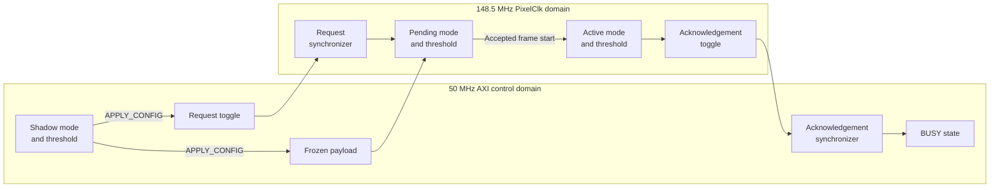
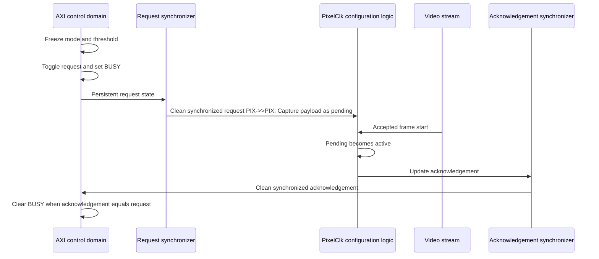

# Configuration Clock-Domain Crossing

This document describes how the requested video mode and Sobel threshold cross from the 50 MHz AXI control domain into the approximately 148.5 MHz PixelClk domain.

The design uses a bundled-data request/acknowledgement handshake:

- Mode and threshold are registered and frozen in the AXI domain.
- A single-bit request toggle crosses into the PixelClk domain.
- The PixelClk domain captures the stable payload into pending registers.
- The pending configuration becomes active at an accepted frame start.
- A single-bit acknowledgement toggle crosses back to the AXI domain.
- The AXI peripheral clears `BUSY` after the acknowledgement matches the request.

## Clock domains

| Domain | Clock | Approximate frequency | Main responsibility |
|---|---|---:|---|
| AXI control | `S_AXI_ACLK` | 50 MHz | Software-visible registers and request generation |
| Video processing | `PixelClk` | 148.5 MHz | Pending capture, frame activation, and output selection |

The clocks are asynchronous. Their rising edges have no fixed phase relationship.
Normal register-to-register timing assumptions cannot be applied directly between these domains.

## Why a CDC protocol is required

Directly sampling the AXI configuration in the PixelClk domain would create two risks.

### Single-bit metastability

A destination flip-flop can violate setup or hold timing when an asynchronous signal changes close to a `PixelClk` edge.

The flip-flop may temporarily enter a metastable state before resolving to zero or one.

### Multi-bit incoherence

Mode and threshold contain multiple bits:

```text
Mode:       2 bits
Threshold:  8 bits
```

Synchronizing each bit independently does not guarantee that all bits are observed from the same configuration update.

The destination could capture a mixture of old and new values.

The design therefore synchronizes only the request and acknowledgement controls. The payload is transferred using bundled-data stability.

## Configuration signals

### AXI-domain state

| Signal | Purpose |
|---|---|
| `payload_mode_axi` | Frozen mode payload |
| `payload_threshold_axi` | Frozen threshold payload |
| `req_toggle_axi` | Persistent request state |
| `update_busy_axi` | Indicates an outstanding configuration transaction |
| `ack_sync1_axi` | First acknowledgement synchronizer stage |
| `ack_sync2_axi` | Second acknowledgement synchronizer stage |

### PixelClk-domain state

| Signal | Purpose |
|---|---|
| `req_sync1_pixel` | First request synchronizer stage |
| `req_sync2_pixel` | Second request synchronizer stage |
| `req_seen_pixel` | Last request already captured |
| `pending_mode_pixel` | Pending mode |
| `pending_threshold_pixel` | Pending threshold |
| `config_pending_pixel` | Pending configuration is waiting for activation |
| `active_mode_pixel` | Mode currently used by the video pipeline |
| `active_threshold_pixel` | Threshold currently used by the video pipeline |
| `ack_toggle_pixel` | Last request acknowledged by the PixelClk domain |

## CDC architecture



The payload path is multi-bit and unsynchronized.

The request path is single-bit and deliberately delayed through synchronizer registers. This gives the frozen payload time to settle before the destination captures it.

## AXI-domain request generation

Software first writes the shadow mode and threshold registers.

When `APPLY_CONFIG` is accepted while the peripheral is not busy, the AXI domain performs:

```verilog
payload_mode_axi      <= requested_mode;
payload_threshold_axi <= requested_threshold;
req_toggle_axi        <= ~req_toggle_axi;
update_busy_axi       <= 1'b1;
```

The payload and request are updated at the same AXI rising edge.

After that edge:

- The payload remains unchanged.
- The request remains in its new state.
- `BUSY` prevents another accepted configuration update.

The request is a toggle rather than a pulse:

```text
Initial request: 0
First update:    1
Second update:   0
Third update:    1
```

A toggle remains observable until the next configuration transaction and cannot disappear between PixelClk edges like a short pulse.

## Request synchronization

The request crosses into the PixelClk domain through two registers:

```verilog
(* ASYNC_REG = "TRUE" *) logic req_sync1_pixel;
(* ASYNC_REG = "TRUE" *) logic req_sync2_pixel;

always_ff @(posedge PixelClk) begin
    req_sync1_pixel <= req_toggle_axi;
    req_sync2_pixel <= req_sync1_pixel;
end
```

Nominal sequence:

```text
Request changes in AXI domain
→ first eligible PixelClk edge updates req_sync1_pixel
→ next PixelClk edge updates req_sync2_pixel
```

The first stage can become metastable. The second stage gives the first stage approximately one PixelClk period to resolve before the synchronized state is used by normal logic.
The synchronizer reduces the probability of metastability propagation. It does not guarantee a fixed crossing latency.

## Pending payload capture

A new request is detected when:

```verilog
req_sync2_pixel = req_seen_pixel
```

This comparison means that the synchronized request state differs from the last request already processed by the destination.

The destination then captures the frozen payload:

```verilog
if (req_sync2_pixel != req_seen_pixel) begin
    req_seen_pixel          <= req_sync2_pixel;
    pending_mode_pixel      <= payload_mode_axi;
    pending_threshold_pixel <= payload_threshold_axi;
    config_pending_pixel    <= 1'b1;
end
```

After this edge, the pending registers are native PixelClk-domain state.

The active video configuration does not change yet.

## Frame-boundary activation

A pending configuration becomes active only when the first pixel of a frame is accepted:
```verilog
assign frame_start_fire=
    s_axis_tvalid &&
    s_axis_tready &&
    s_axis_tuser;
```

The conditions mean:

```text
TVALID = 1
→ the frame-start pixel is valid

TREADY = 1
→ the pixel is accepted on this edge

TUSER = 1
→ the pixel is the first active pixel of a frame
```

Activation occurs with:
```verilog
if (config_pending_pixel && sof_fire) begin
    active_mode_pixel      <= pending_mode_pixel;
    active_threshold_pixel <= pending_threshold_pixel;
    config_pending_pixel   <= 1'b0;
    ack_toggle_pixel       <= req_seen_pixel;
end
```

Waiting for an accepted start of frame prevents a mode or threshold change from appearing partway through a frame.

`sof_fire` should be derived from the AXI4-Stream stage whose frame boundary defines configuration activation.

## Acknowledgement return

After activation, `ack_toggle_pixel` is updated to the request state that has been processed.

The acknowledgement crosses back through two AXI-clocked registers:

```verilog
(* ASYNC_REG = "TRUE" *) logic ack_sync1_axi;
(* ASYNC_REG = "TRUE" *) logic ack_sync2_axi;

always_ff @(posedge S_AXI_ACLK) begin
    ack_sync1_axi <= ack_toggle_pixel;
    ack_sync2_axi <= ack_sync1_axi;
end
```

The AXI domain clears busy when:
```verilog
ack_sync2_axi == req_toggle_axi
```

The source may then accept another configuration update.

## Request and acknowledgement states

| Request | Synchronized acknowledgement | Meaning |
|---:|---:|---|
| `0` | `0` | No transaction outstanding |
| `1` | `0` | Request state `1` is outstanding |
| `1` | `1` | Request state `1` is complete |
| `0` | `1` | Request state `0` is outstanding |

The key relationship is:

```text
request != acknowledgement
→ configuration transaction is outstanding
→ payload must remain frozen
```

```text
request == acknowledgement
→ latest configuration is complete
→ payload may be reused
```

Equality does not prevent metastability. Synchronizer registers provide metastability containment.

## Complete transaction sequence



The total configuration latency contains:

```text
Request synchronization latency
+
wait for the next accepted frame start
+
acknowledgement synchronization latency
```

The frame-boundary wait normally dominates. At 60 Hz, waiting for the next frame can take up to approximately one frame period.

## Metastability behavior
Suppose the request changes from zero to one near a `PixelClk` edge.
The first synchronizer can:

- Resolve quickly to the new value
- Resolve temporarily to the old value
- Enter metastability and resolve before the second stage samples it

If the first stage resolves to the old value, the request is detected in a later PixelClk edge.

The result is:

```text
Additional configuration latency
```

not:

```text
Last configuration request
```

The request remains in its new state until a later configuration transaction toggles it again.

Delayed request recognition also gives the frozen payload more time to settle.

## Multi-bit payload coherence

The payload is not synchronized one bit at a time.

Correctness depends on this ordering:

```text
Payload becomes stable
→ synchronized request is detected
→ destination captures payload
```

The request path contains two synchronizer stages and sequential request detection. The payload travels directly from frozen AXI registers to the pending-register inputs.

The required timing relationship is:

```text
Maximum payload-path delay
<
minimum request-control delay to pending capture
-
destination setup margin
```

The payload remains stable after capture until the acknowledgement returns, providing a large hold-time margin.

The protocol therefore protects against:

- Different payload bits being sampled in different AXI update cycles
- Software overwriting a payload while it is being transferred
- A request pulse being missed between PixelClk edges

## Reset behavior
Both domains must start from corresponding request and acknowledgement states.

Recommended reset state:
```text
req_toggle_axi          = 0
req_sync1_pixel         = 0
req_sync2_pixel         = 0
req_seen_pixel          = 0
ack_toggle_pixel        = 0
ack_sync1_axi           = 0
ack_sync2_axi           = 0
update_busy_axi         = 0
config_pending_pixel    = 0
```

The active and pending values should reset to defined mode and threshold values.

If one domain resets independently while a transaction is outstanding, the toggle relationship can be lost or interpreted as a new request. Independent reset behavior must therefore be deliberately defined.
