# PS-to-PL AXI4-Lite Communication

This document describes how the ARM Cortex-A9 communicates with the custom `video_control_axi` peripheral through `M_AXI_GP0` and SmartConnect with 32-bit AXI4-Lite interface.

The interface carries low-rate control and status information only. HDMI pixels use a separate AXI4-Stream datapath inside the Programmable Logic.

## Communication path

```mermaid
flowchart LR
    subgraph HOST["Host computer"]
        TERM["PuTTY"]
        USB["USB-UART"]
        TERM <--> USB
    end

    subgraph PS["Zynq-7000 Processing System"]
        UART["PS UART through MIO"]
        APP["Bare-metal application"]
        CPU["ARM Cortex-A9"]
        GP0["M_AXI_GP0"]

        UART <--> APP
        APP --> CPU
        CPU --> GP0
    end

    subgraph PL["Programmable Logic: 50 MHz AXI domain"]
        SC["SmartConnect"]
        CTRL["video_control_axi"]
        REGS["Control and status registers"]
        CDC["Configuration CDC"]

        SC --> CTRL
        CTRL --> REGS
        REGS --> CDC
    end

    USB <--> UART
    GP0 -->|"AXI4-Lite"| SC
```



The AXI peripheral uses:

```text
Data width:      32 bits
Address width:   5 bits
Register count:  8
Clock:           S_AXI_ACLK
Reset:           active-low S_AXI_ARESETN
```

## AXI4-Lite interface

The interface contains five channels:

| Channel | Direction | Purpose |
|---|---|---|
| `AW` | PS to PL | Write address |
| `W` | PS to PL | Write data and byte strobes |
| `B` | PL to PS | Write response |
| `AR` | PS to PL | Read address |
| `R` | PL to PS | Read data and response |

A channel transfer occurs when its `VALID` and `READY` signals are both high on a rising edge of `S_AXI_ACLK`.

## Register addressing

The AXI data width is 32 bits, so every register occupies four byte addresses.

The RTL calculates:

```verilog
localparam integer ADDR_LSB = (C_S_AXI_DATA_WIDTH / 32) + 1;
```

For a 32-bit data bus:

```text
ADDR_LSB = 2
```
The register index is selected using address bits `[4:2]`.

The two least-significant bits select bytes within a 32-bit word and are not used for register selection.

| Address offset | Address bits `[4:2]` | Register index |
|---:|---:|---:|
| `0x00` | `000` | `0` |
| `0x04` | `001` | `1` |
| `0x08` | `010` | `2` |
| `0x0C` | `011` | `3` |
| `0x10` | `100` | `4` |
| `0x14` | `101` | `5` |
| `0x18` | `110` | `6` |
| `0x1C` | `111` | `7` |

## Write transaction

The PS uses `Xil_Out32()` to generate a memory-mapped write.

A complete write uses:

```text
AW channel → address
W channel → data and byte strobes
B channel → completion response
```

### Write state machine

The current write state machine contains three states:

```text
Idle
Waddr
Wdata
```

The normal sequence is:

```text
Reset
→ Idle
→ Waddr
→ accept address and possibly data
→ generate write response
```

If the address is accepted before the data:

```text
Waddr
→ capture AWADDR
→ Wdata
→ wait for WVALID
→ generate write response
→ Waddr
```

### Write-address acceptance

The address is accepted when:

```verilog
S_AXI_AWVALID && S_AXI_AWREADY
```

The accepted address is stored in:

```verilog
axi_awaddr <= S_AXI_AWADDR;
```

The stored address is used if write data arrives on a later clock.

The write-register index is selected as:

```verilog
assign write_reg_index =
    (S_AXI_AWVALID && S_AXI_AWREADY)
    ? S_AXI_AWADDR[
        ADDR_LSB + OPT_MEM_ADDR_BITS : ADDR_LSB
      ]
    : axi_awaddr[
        ADDR_LSB + OPT_MEM_ADDR_BITS : ADDR_LSB
      ];
```

Therefore:

```text
Address accepted in the current cycle → use S_AXI_AWADDR directly
No address accepted in the current cycle → use the previously stored axi_awaddr
```

### Write-data acceptance

The RTL defines:

```verilog
assign write_data_fire = S_AXI_WVALID && S_AXI_WREADY;
```

The memory-mapped register block currently updates when:

```verilog
if (S_AXI_WVALID)
```

Because `axi_wready` is asserted after reset and is not normally deasserted, `S_AXI_WVALID` generally also represents an accepted W-channel transfer.

For clarity and protocol accuracy, the register-write condition should eventually use:

```verilog
if (write_data_fire)
```

### Register write logic

The register block selects the target address using:

```verilog
(S_AXI_AWVALID && S_AXI_AWREADY)
? S_AXI_AWADDR[4:2]
: axi_awaddr[4:2]
```

This supports two intended write sequences.

#### Address and data together

```text
AWVALID = 1
WVALID  = 1
AWREADY = 1
WREADY  = 1
```

The current `S_AXI_AWADDR` selects the register, and `S_AXI_WDATA` is written on the same rising edge.

#### Address before data

```text
Cycle N:
AWVALID = 1
WVALID  = 0
→ address is stored in axi_awaddr

Later cycle:
WVALID = 1
→ stored axi_awaddr selects the register
→ S_AXI_WDATA is written
```

Only `slv_reg0` through `slv_reg3` are writable:

```text
slv_reg0 → CONTROL_SHADOW
slv_reg1 → THRESHOLD_SHADOW
slv_reg2 → COMMAND
slv_reg3 → SCRATCH
```

Registers `slv_reg4` through `slv_reg7` are not written by the register-write case statement.

### Write strobes

`S_AXI_WSTRB` contains one byte-enable bit for each byte of `S_AXI_WDATA`.

| Strobe | Controlled byte |
|---|---|
| `WSTRB[0]` | `WDATA[7:0]` |
| `WSTRB[1]` | `WDATA[15:8]` |
| `WSTRB[2]` | `WDATA[23:16]` |
| `WSTRB[3]` | `WDATA[31:24]` |

The writable registers update only enabled bytes:

```verilog
for (
    byte_index = 0;
    byte_index <= (C_S_AXI_DATA_WIDTH / 8) - 1;
    byte_index = byte_index + 1
)
begin
    if (S_AXI_WSTRB[byte_index] == 1'b1)
    begin
        slv_reg0[(byte_index * 8) +: 8]
            <= S_AXI_WDATA[(byte_index * 8) +: 8];
    end
end
```

The `APPLY_CONFIG` command additionally requires:

```verilog
S_AXI_WSTRB[0] && S_AXI_WDATA[0]
```

because the command is stored in bit 0 of the lowest byte.

### Write response

When the write state machine receives the required address and data, it asserts:

```verilog
axi_bvalid <= 1'b1;
```

The output connections are:

```verilog
assign S_AXI_BVALID = axi_bvalid;
assign S_AXI_BRESP  = axi_bresp;
```

`axi_bresp` remains zero, representing:

```text
BRESP = 2'b00
→ OKAY
```

The response is accepted when:

```text
S_AXI_BVALID && S_AXI_BREADY
```

After acceptance:

```verilog
axi_bvalid <= 1'b0;
```

### Current write-channel limitation

AXI allows the write-address and write-data channels to arrive independently.

The current implementation safely handles:

```text
AW before W
AW and W together
```

The current implementation does not safely handle:

```text
W before AW
```

If `S_AXI_WVALID` is asserted before a new write address is accepted, the register-write block can use the previous value of `axi_awaddr`.

The current implementation therefore relies on the connected PS and SmartConnect path presenting the write address no later than the corresponding write data.

The slave also does not support several outstanding write transactions. Software must complete one AXI write and receive its B-channel response before starting another write.

## Read transaction

The PS uses `Xil_In32()` to generate a memory-mapped read.

A complete read uses:

```text
AR channel → read address
R channel → read data and response
```

### Read state machine

The read state machine contains:

```text
Idle
Raddr
Rdata
```

The normal sequence is:

```text
Reset
→ Idle
→ Raddr
→ accept read address
→ Rdata
→ hold response until accepted
→ Raddr
```

### Read-address acceptance

In `Raddr`, the peripheral asserts:

```verilog
axi_arready <= 1'b1;
```

The address is accepted when:

```verilog
S_AXI_ARVALID && S_AXI_ARREADY
```

At the accepting edge:

```verilog
axi_araddr <= S_AXI_ARADDR;
axi_rvalid <= 1'b1;
axi_arready <= 1'b0;
state_read <= Rdata;
```

The accepted address remains stored in `axi_araddr` while the read response is pending.

A second read address is not accepted until the current R-channel transaction has completed.

### Read-data selection

The read multiplexer uses:

```verilog
axi_araddr[4:2]
```

to select the returned value:

```verilog
always @(*)
begin
    case (axi_araddr[
        ADDR_LSB + OPT_MEM_ADDR_BITS : ADDR_LSB
    ])
        3'h0: reg_data_out = slv_reg0;
        3'h1: reg_data_out = slv_reg1;
        3'h2: reg_data_out = slv_reg2;
        3'h3: reg_data_out = slv_reg3;

        3'h4:
            reg_data_out =  {31'd0, update_busy_axi};

        3'h5:
            reg_data_out = {16'd0, active_threshold_status_axi, 5'd0, active_mode_status_axi, 1'b0};

        3'h6:
            reg_data_out = 32'h000000000;

        3'h7:
            reg_data_out = CORE_ID;

        default:
            reg_data_out = 32'h0000_0000;
    endcase
end
```

The read data output is:

```verilog
assign S_AXI_RDATA = reg_data_out;
```

### Read-data handshake

The peripheral asserts `S_AXI_RVALID` after accepting the read address.

The response is accepted when:

```text
S_AXI_RVALID && S_AXI_RREADY
```

Until that handshake occurs:

- `axi_araddr` remains unchanged.
- `S_AXI_RDATA` remains selected from the same address.
- `S_AXI_RVALID` remains asserted.
- `S_AXI_RRESP` remains zero.

After the handshake:

```verilog
axi_rvalid <= 1'b0;
axi_arread <= 1'b1;
state_read <= Raddr;
```

## Register map
| Offset | Register | Access | Actual RTL behavior |
|---:|---|---|---|
| `0x00` | `CONTROL_SHADOW` | Read/write | `slv_reg0`; mode stored in bits `[2:1]` |
| `0x04` | `THRESHOLD_SHADOW` | Read/write | `slv_reg1`; threshold stored in bits `[7:0]` |
| `0x08` | `COMMAND` | Read/write event register | `slv_reg2`; bit 0 also generates `apply_config_event` |
| `0x0C` | `SCRATCH` | Read/Write | `slv_reg3` |
| `0x10` | `STATUS` | Read-only | `{31'd0, update_busy_axi}` |
| `0x14` | `ACTIVE_CONFIG` | Read-only | Active threshold in `[15:8]`, active mode in `[2:1]` |
| `0x18` | Reserved | Read-only | Returns zero |
| `0x1C` | `CORE_ID` | Read-only | Returns `0x534F424C` |

Although `COMMAND` is stored in `slv_reg2`, the configuration request is generated from the accepted W-channel value:

```verilog
assign apply_config_event =
    write_data_fire           &&
    (write_reg_index == 3'h2) &&
    S_AXI_WSTRB[0]            &&
    S_AXI_WDATA[0];
```

The command bit therefore does not need to return to zero before another command. Each accepted write of one to bit 0 generates a new command event, provided `update_busy_axi` is zero.
