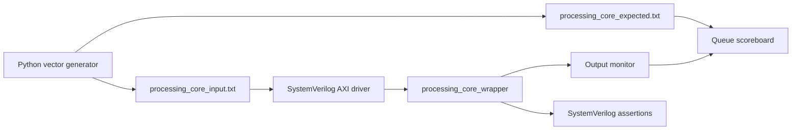

# Verification

This document describes how the FPGA video-processing core is verified using an independent Python golden model and a self-checking SystemVerilog testbench.

The verification environment checks both:
- **Functional correctness**, including grayscale conversion, 3x3 window alignment, Sobel processing, border behavior, and original-pixel alignment
- **AXI4-Stream protocol behavior**, including transaction acceptance, backpressure, data stability, metadata alignment, and pipeline draining

The Python model generates deterministic input pixels and the expected output values. The SystemVerilog testbench converts the generated input file into protocol-correct AXI4-Stream transactions, monitors accepted DUT outputs, and compares every output against the corresponding expected transaction.

The verification architecture is:



## Expected transaction

A packed struct is defined to bundle the video pipeline transaction data into a single, contiguous bit vector including: `sobel_rgb`, `grayscale_rgb`, and `original_rgb`, all aligned with the same `user` and `last` data.

```systemverilog
typedef struct packed {
    logic [23:0] sobel_rgb;
    logic [23:0] grayscale_rgb;
    logic [23:0] original_rgb;
    logic user;
    logic last;
} exp_t;
```
The unbounded queue `exp_q` holds a sequence of expected exp_t pixels waiting to be compared against what actually comes out of the hardware.

```systemverilog
exp_t exp_q[$];
```

## Scoreboard behavior

```text
Accepted DUT output
→ pop the next expected queue item
→ compare Sobel
→ compare grayscale
→ compare original RGB
→ compare TUSER
→ compare TLAST
```

Four-state comparison operators are used so that `X` and `Z` values are reported as mismatches.

## Assertions

While the scoreboard verifies accepted transaction contents, the assertions verify behaviors between accepted transactions.

The current assertions check 6 rules:

- #1: Output transaction stability during downstream backpressure
- #2: Input transaction stability while the DUT is not ready
- #3: `TUSER` is never asserted without `TVALID`
- #4: `TLAST` is never asserted without `TVALID`
- #5: Input control signals do not become unknown after reset
- #6: Output control signals do not become unknown after reset

## Verification modes

```text
Always-ready test → arithmetic, spatial alignment, metadata, and transaction count

Random-backpressure test → stall stability, upstream backpressure, and ordered recovery
```
